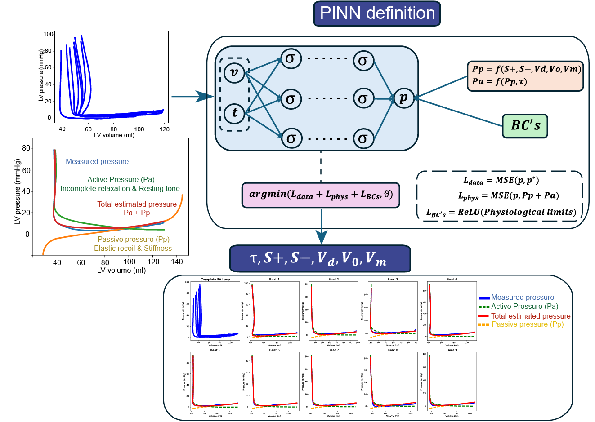

# PVLoop_PINN

This is a repository to extract constitutive parameters from Left Ventricle Pressure Volume loops using PINNs.
Given Left Ventricle Pressure Volume loop data during diastole (pressure, volume and time), the algorithm recovers constitutive parameters from passive an active pressure equations.

## Quickstart

Follow these steps to set up your conda environment and start using this repository.

### 1. Clone the Repository

```bash
git clone https://github.com/jftopham/PVloop_PINN.git
cd PVloop_PINN
```

### 2. Create the Conda Environment

If an `environment.yml` file is provided, run:

```bash
conda env create -f environment.yml
```

If no `environment.yml` exists, create a new environment (replace `myenv` with your preferred name and python version):

```bash
conda create -n myenv python=3.9
conda activate myenv
# Manually install required packages:
# conda install <package1> <package2> ...
```

### 3. Activate the Conda Environment

```bash
conda activate myenv
```

### 4. Install Any Additional Dependencies

If the repo uses `requirements.txt` for extra pip packages:

```bash
pip install -r requirements.txt
```

### 5. Start Using the Repository

Refer to the documentation or run the main script:

```bash
python main.py
```

---

**Troubleshooting:**
- If you encounter issues, ensure you have [Miniconda](https://docs.conda.io/en/latest/miniconda.html) or [Anaconda](https://www.anaconda.com/products/distribution) installed.
- For more details, see the [official conda documentation](https://docs.conda.io/projects/conda/en/latest/user-guide/tasks/manage-environments.html).

---

## Citation

If you use our model in your research, please cite:

```
@article{AuthorYearModelName,
  title={A Physics-Informed machine learning approach to estimate the intrinsic diastolic properties of the Left Ventricle},
  author={Author,Javier Fernández-Topham},
  journal={Journal Name},
  year={2025},
  url={https://github.com/jftopham/PVloop_PINN}
}
```
