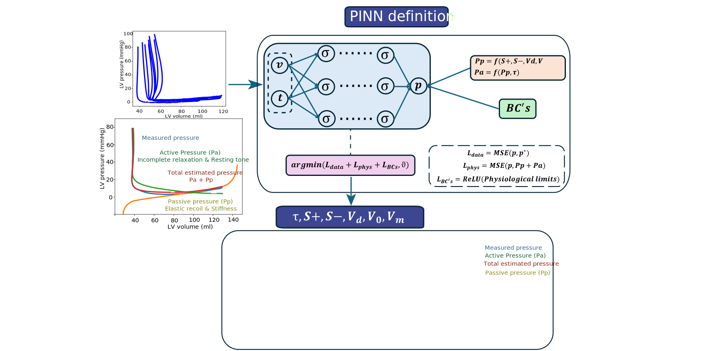

# PVLoop_PINN

This is a repository to extract constitutive parameters from LV PV loops using PINNs

## Citation

If you use our model in your research, please cite:

```
@article{AuthorYearModelName,
  title={Model Name: Short Description},
  author={Author, A. and Collaborator, B.},
  journal={Journal Name},
  year={2025},
  url={https://github.com/yourusername/yourrepo}
}
```
