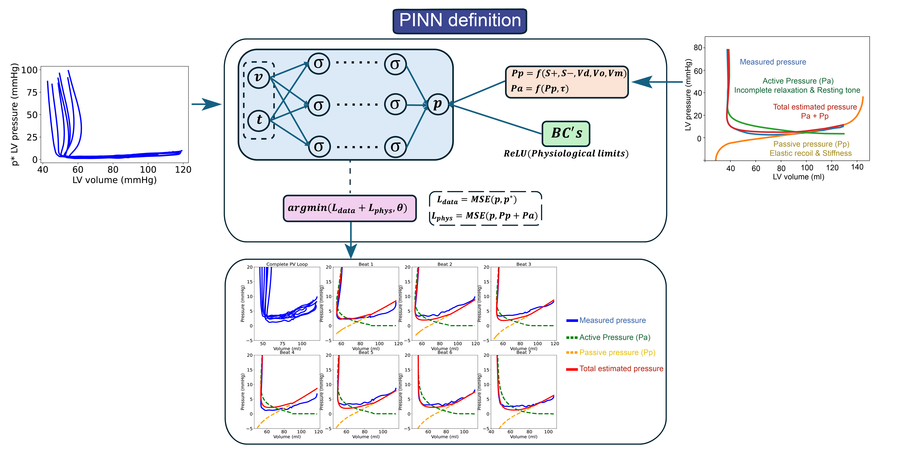

# DIA-PINN

This is a repository to extract constitutive parameters from Left Ventricle Pressure Volume loops using PINNs.
Given Left Ventricle Pressure Volume loop data during diastole (pressure, volume and time), the algorithm recovers constitutive parameters from passive an active pressure equations.

## Data Input Format

The model expects input data in **CSV format**, where each file contains measurements for several **cardiac beats**.  
For every beat, three variables must be provided:

- **Time (`t_i`)**
- **Volume (`v_i`)**
- **Pressure (`p_i`)**

Each variable is stored in a separate column.


### Column Naming Convention

Columns should follow this naming pattern:
| t_0 | v_0 | p_0 | t_1 | v_1 | p_1 | ... | t_n | v_n | p_n | 
|-----|-----|-----|-----|-----|-----|-----|-----|-----|-----|

Where:

- `i` is the **beat index**, starting from **0**
- Each beat has **three columns**:
  - `t_i` → time
  - `v_i` → volume
  - `p_i` → pressure
  - 
The number of beats is automatically inferred as: n_beats = total_number_of_columns / 3


### Units

The expected units are:

|  Column | Description |    Unit in CSV   |         Conversion in Code              |
|---------|-------------|------------------|-----------------------------------------|
|  `t_i`  | Time        | seconds          | converted to **milliseconds** (`×1000`) |
|  `v_i`  | Volume      | milliliters (ml) | unchanged                               |
|  `p_i`  | Pressure    | mmHg             | unchanged                               |


### Requirements

To avoid loading errors column names **must** be defined as `t_i`, `v_i`, `p_i`

## Quickstart

Follow these steps to set up your conda environment and start using this repository.

### 1. Clone the Repository

```bash
git clone https://github.com/jftopham/PVloop_PINN.git
cd PVloop_PINN
```

### 2. Create the Conda Environment

If an `environment.yml` file is provided, run:

```bash
conda env create -f environment.yml
```

If no `environment.yml` exists, create a new environment (replace `myenv` with your preferred name and python version):

```bash
conda create -n myenv python=3.9
conda activate myenv
# Manually install required packages:
# conda install <package1> <package2> ...
```

### 3. Activate the Conda Environment

```bash
conda activate myenv
```

### 4. Start Using the Repository

Run the main script:

```bash
python pinn_PVloop.py
```

---

**Troubleshooting:**
- If you encounter issues, ensure you have [Miniconda](https://docs.conda.io/en/latest/miniconda.html) or [Anaconda](https://www.anaconda.com/products/distribution) installed.
- For more details, see the [official conda documentation](https://docs.conda.io/projects/conda/en/latest/user-guide/tasks/manage-environments.html).

---
